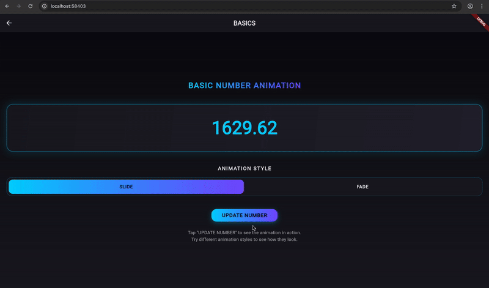

# Flutter Number Flow

[](https://pub.dev/packages/flutter_number_flow)
[](https://pub.dev/packages/flutter_number_flow/score)
[](https://pub.dev/packages/flutter_number_flow/score)
[](https://pub.dev/packages/flutter_number_flow/score)
[](https://opensource.org/licenses/MIT)

A beautiful Flutter widget that animates number changes with smooth, customizable transitions. Perfect for displaying animated counters, currency values, statistics, and more with a professional, polished look.

## ✨ Features

- 🎯 **Smooth Number Animations**: Animate only the digits that change, keeping unchanged digits stable
- 🎨 **Multiple Animation Styles**: Choose between slide and crossFade animations for different visual effects
- 🌍 **Locale-Aware Formatting**: Support for different locales, currencies, and number formats using `intl`
- 📊 **Compact Notation**: Display large numbers in compact format (1.2K, 1.5M, 2.1B)
- ⚡ **High Performance**: Optimized with text metrics caching and tabular figures for consistent layout
- 🎛️ **Group Synchronization**: Synchronize animations across multiple NumberFlow widgets
- 🎮 **Manual Control**: Drive animations manually with scrub progress for timeline controls
- ♿ **Accessibility**: Proper semantics support for screen readers
- 🎭 **Customizable**: Full control over text styles, animation duration, and curves
- 📱 **Material 3**: Built with Material Design 3 principles

## 📱 Demo

<table>
  <tr>
    <td align="center">
      
      <br/>
      <strong>Mobile App</strong>
    </td>
    <td align="center">
      
      <br/>
      <strong>Web App</strong>
    </td>
  </tr>
</table>

## 📱 Live Demo

Try the [interactive web demo](https://flutter_number_flow_demo.web.app) to see all features in action.

## 🚀 Quick Start

### Installation

Add `flutter_number_flow` to your `pubspec.yaml`:

```yaml
dependencies:
  flutter_number_flow: ^0.1.0
```

Then run:

```bash
flutter pub get
```

### Basic Usage

```dart
import 'package:flutter/material.dart';
import 'package:flutter_number_flow/number_flow.dart';

class CounterExample extends StatefulWidget {
  @override
  _CounterExampleState createState() => _CounterExampleState();
}

class _CounterExampleState extends State<CounterExample> {
  double _value = 0;

  @override
  Widget build(BuildContext context) {
    return Scaffold(
      body: Center(
        child: Column(
          mainAxisAlignment: MainAxisAlignment.center,
          children: [
            NumberFlow(
              value: _value,
              textStyle: const TextStyle(
                fontSize: 48,
                fontWeight: FontWeight.bold,
              ),
            ),
            const SizedBox(height: 32),
            ElevatedButton(
              onPressed: () => setState(() => _value += 1),
              child: const Text('Increment'),
            ),
          ],
        ),
      ),
    );
  }
}
```

## 🎨 Animation Styles

### Slide Animation
Numbers slide vertically when changing, creating a smooth rolling effect:

```dart
NumberFlow(
  value: 1234.56,
  animationStyle: NumberFlowAnimation.slide,
  duration: const Duration(milliseconds: 600),
)
```

### CrossFade Animation
Numbers fade between old and new values for a subtle transition:

```dart
NumberFlow(
  value: 1234.56,
  animationStyle: NumberFlowAnimation.crossFade,
  duration: const Duration(milliseconds: 400),
)
```

## 🌍 Formatting & Localization

### Currency Formatting

```dart
NumberFlow(
  value: 1234.56,
  format: const NumberFlowFormat(
    prefix: '\$',
    minimumFractionDigits: 2,
    maximumFractionDigits: 2,
  ),
  textStyle: const TextStyle(
    fontSize: 32,
    color: Colors.green,
    fontWeight: FontWeight.bold,
  ),
)
```

### Compact Notation

Display large numbers in a readable format:

```dart
NumberFlow(
  value: 1500000,
  format: const NumberFlowFormat(
    notation: NumberNotation.compact,
    maximumFractionDigits: 1,
  ),
) // Displays "1.5M"
```

### Locale Support

```dart
NumberFlow(
  value: 1234.56,
  format: const NumberFlowFormat(
    locale: 'de_DE', // German locale
    minimumFractionDigits: 2,
  ),
) // Displays "1.234,56"
```

## 🎛️ Advanced Features

### Group Synchronization

Synchronize animations across multiple widgets:

```dart
NumberFlowGroupProvider(
  groupKey: 'financials',
  duration: const Duration(milliseconds: 800),
  child: Column(
    children: [
      NumberFlow(
        value: revenue,
        groupKey: 'financials',
        format: const NumberFlowFormat(prefix: '\$'),
      ),
      NumberFlow(
        value: expenses,
        groupKey: 'financials',
        format: const NumberFlowFormat(prefix: '\$'),
      ),
    ],
  ),
)
```

### Manual Animation Control

Drive animations manually for timeline scrubbing:

```dart
class ScrubExample extends StatefulWidget {
  @override
  _ScrubExampleState createState() => _ScrubExampleState();
}

class _ScrubExampleState extends State<ScrubExample> {
  double _progress = 0.0;
  final double _startValue = 0;
  final double _endValue = 1000000;

  @override
  Widget build(BuildContext context) {
    final currentValue = _startValue + (_endValue - _startValue) * _progress;
    
    return Column(
      children: [
        NumberFlow(
          value: currentValue,
          scrubProgress: _progress,
          format: const NumberFlowFormat(
            prefix: '\$',
            notation: NumberNotation.compact,
          ),
        ),
        Slider(
          value: _progress,
          onChanged: (value) => setState(() => _progress = value),
        ),
      ],
    );
  }
}
```

## 📋 API Reference

### NumberFlow Widget

| Property | Type | Default | Description |
|----------|------|---------|-------------|
| `value` | `num` | required | Current number value to display |
| `previousValue` | `num?` | `null` | Previous value for animation (auto-detected if null) |
| `textStyle` | `TextStyle?` | `null` | Text style for the number display |
| `animationStyle` | `NumberFlowAnimation` | `slide` | Animation style (slide or crossFade) |
| `duration` | `Duration` | `600ms` | Animation duration |
| `curve` | `Curve` | `easeInOut` | Animation curve |
| `format` | `NumberFlowFormat?` | `null` | Number formatting options |
| `textAlign` | `TextAlign` | `center` | Text alignment |
| `groupKey` | `String?` | `null` | Group key for synchronization |
| `scrubProgress` | `double?` | `null` | Manual animation progress (0.0-1.0) |
| `enableMask` | `bool` | `true` | Enable edge masking for smooth clipping |

### NumberFlowFormat

| Property | Type | Default | Description |
|----------|------|---------|-------------|
| `locale` | `String?` | `null` | Locale for number formatting |
| `notation` | `NumberNotation` | `standard` | Number notation (standard or compact) |
| `prefix` | `String?` | `null` | Text to display before the number |
| `suffix` | `String?` | `null` | Text to display after the number |
| `minimumFractionDigits` | `int?` | `null` | Minimum decimal places |
| `maximumFractionDigits` | `int?` | `null` | Maximum decimal places |

### NumberFlowAnimation

```dart
enum NumberFlowAnimation {
  slide,     // Vertical sliding animation
  crossFade, // Opacity transition animation
}
```

### NumberNotation

```dart
enum NumberNotation {
  standard, // 1,234,567
  compact,  // 1.2M
}
```

## 🎯 Performance

Flutter Number Flow is optimized for performance:

- **Text Metrics Caching**: Glyph dimensions are cached to avoid repeated calculations
- **Tabular Figures**: Uses `FontFeature.tabularFigures()` for consistent digit widths
- **Efficient Diffing**: Only animates digits that actually change
- **Minimal Rebuilds**: Smart widget composition minimizes unnecessary rebuilds

## ♿ Accessibility

The widget follows Flutter accessibility best practices:

- **Semantic Labels**: Screen readers announce the complete number value
- **Proper Focus**: Supports keyboard navigation and focus management
- **High Contrast**: Works well with system accessibility settings

## 🧪 Testing

The package includes comprehensive tests:

```bash
flutter test
```

Run golden tests to verify visual output:

```bash
flutter test --update-goldens
```

## 🤝 Contributing

Contributions are welcome! Please read our [contributing guide](CONTRIBUTING.md) and [code of conduct](CODE_OF_CONDUCT.md).

### Development Setup

1. Clone the repository:
   ```bash
   git clone https://github.com/example/flutter_number_flow.git
   cd flutter_number_flow
   ```

2. Get dependencies:
   ```bash
   flutter pub get
   ```

3. Run the example:
   ```bash
   cd example
   flutter run
   ```

4. Run tests:
   ```bash
   flutter test
   ```

## 📄 License

This project is licensed under the MIT License - see the [LICENSE](LICENSE) file for details.

## 🙏 Acknowledgments

- Inspired by the [number-flow](https://github.com/barvian/number-flow) React library
- Built with [Flutter](https://flutter.dev) and [Dart](https://dart.dev)
- Uses the [intl](https://pub.dev/packages/intl) package for internationalization

## 📊 Changelog

See [CHANGELOG.md](CHANGELOG.md) for a detailed list of changes and migration guides.

## 💬 Support

- 📖 [Documentation](https://pub.dev/documentation/flutter_number_flow/latest/)
- 🐛 [Issue Tracker](https://github.com/example/flutter_number_flow/issues)
- 💬 [Discussions](https://github.com/example/flutter_number_flow/discussions)
- 📧 [Email Support](mailto:support@example.com)

---

<p align="center">
  Made with ❤️ by the Flutter Number Flow team
</p>